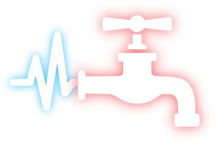

  # Beat Piper

  

  
  
  
   
  
  
   
  
  

# Motivation
I got into Beat Saber but haven't found a good way to automatically find beatmaps for songs I know. There are some similar projects, but they are either paid or I haven't had a good experience with them. 

# Retrieval methods
## Spotify API
You can use the Spotify Web API to fetch your playlists.
For that you need to copy `.env.example` to `.env` and fill in the required fields.

## Public playlists
Alternatively you can provide a link to a public playlist.
This has a limitation of only fetching the first 100 songs. [See why](https://github.com/microlinkhq/spotify-url-info/issues/69#issuecomment-802364053)

# Usage
⚠️ This tool is currently alpha quality software and is not ready for production use.

1. Run `yarn install`
2. Run `yarn start`

# Attributions

I got the name from a [reddit post](https://www.reddit.com/r/beatsaber/comments/hneox9/comment/fxbynuq) from [@PapuaNewGuinean](https://www.reddit.com/user/PapuaNewGuinean). I hope that's okay
